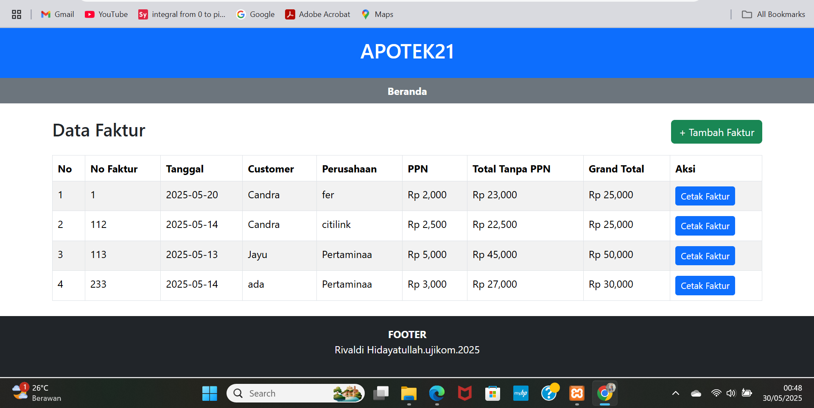

# 🧺 Aplikasi Web Laundry

Aplikasi Web Apotek ini merupakan sistem informasi berbasis PHP dan MySQL yang dirancang untuk membantu pengelolaan penjualan obat di apotek secara efisien. Dilengkapi dengan fitur manajemen data obat, pelanggan, transaksi penjualan, serta pencetakan faktur penjualan secara otomatis.

## 📸 Tampilan Antarmuka

## ⚙️ Instalasi
1. Clone repository ini.
2. Import database.
3. Sesuaikan koneksi database di `database/penjualan.php`.
4. Akses melalui browser dengan `localhost/penjualan`.

